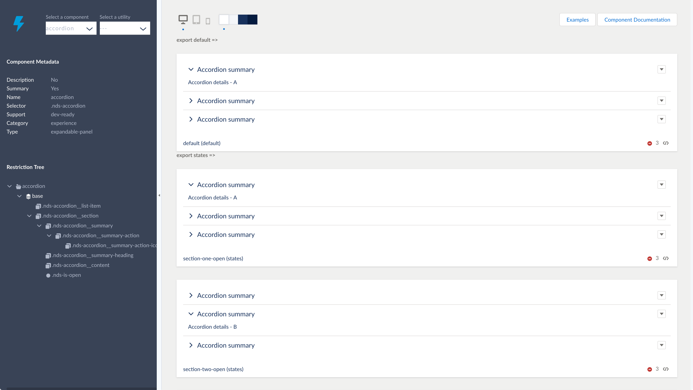

# Vlocity Newport Design System

Welcome to the Vlocity Newport Design System brought to you by [Vlocity](https://vlocity.com).

Tailored for building Vlocity Newport apps: Using the Newport Design System markup and CSS framework results in UIs that reflect the Vlocity Newport look and feel. Includes Storybook.js previewer to help you customize and rebrand all of Vlocity's newport based templates in one place.

Want to see the project hosted live? Go to [http://newport.vlocinternal.com/](http://newport.vlocinternal.com/)

## Pre-requisites

> NOTE: You'll need to use the command line to work with Newport, if you're not familar with the command line we recommend following the short _Git Tower Command Line 101_ tutorial: https://www.git-tower.com/learn/git/ebook/en/command-line/appendix/command-line-101

You'll need the following installed:

- Install Git: https://git-scm.com/downloads
- Install Node.js: https://nodejs.org/en/download/
- Install gulp-cli - after installing the above open your command prompt and run `npm install --global gulp-cli`

## Quick start

Clone the project with

```bash
git clone https://github.com/vlocityinc/newport-design-system.git
```

Change into the `newport-design-system` folder using

```bash
cd newport-design-system
```

(optional) Switch to the right branch for your version of the Salesforce package, for example

```bash
git checkout ins-108.0
```

Install the dependencies by running:

```bash
npm install
```

Finally you can launch Storybook previewer by running:

```bash
npm start
```



Having trouble getting these steps to work on your machine? Follow the [troubleshooting](#troubleshooting) guide below.

## Docs

For more indepth documentation please checkout the _documentation_ section in storybook.

## Browser compatibility

We support the latest versions of all browsers and IE 11.

### Generating the zip to deploy

When you have an updated version of Newport that you're happy with and want to test in an org you can run the following command:

```bash
npm run build && npm run dist
```

This will generate a zipped up version to be uploaded into Salesforce in the `dist` folder in your workspace.

If you also want to deploy it to an org then run it with the following env variables:

```bash
SF_USERNAME=myusername@email.com SF_PASSWORD=mypassword SF_LOGINURL=myLoginUrl npm run dist
```
If the SF_LOGINURL argument is not passed, then it defaults to https://login.salesforce.com


## Troubleshooting

### npm and Node.js

The Vlocity Newport Design System uses `npm` to manage dependencies. Please [install Node.js](https://nodejs.org), and try running `npm install` again.

If Node.js is already installed, make sure you’re running v8 or up.

### JavaScript and compilation issues

JavaScript dependencies sometimes get out of sync and inexplicable bugs start to happen. Follow these steps to give a fresh start to your development environment:

1. The installed `npm` version must be at least v3.10. You can update your npm with: `npm install npm -g` (`sudo` may be required).
2. Re-install dependencies: `rm -Rf node_modules && npm install`
3. `npm start`

If this did not work, try running `npm cache clean` and repeat the above steps.

## Licenses

- Originally forked from [Salesforce Lightning Design System](https://lightningdesignsystem.com).
- Source code is licensed under [BSD 3-Clause](https://git.io/sfdc-license)
- All icons and images are licensed under [Creative Commons Attribution-NoDerivatives 4.0](https://github.com/vlocityinc/newport-design-system/blob/master/LICENSE-icons-images.txt)
- The Lato font is licensed under the [SIL OPEN FONT LICENSE](https://github.com/vlocityinc/newport-design-system/blob/master/LICENSE-font.txt)

## Got feedback?

Please open a new <a href="https://github.com/vlocityinc/newport-design-system/issues">GitHub Issue</a>.
