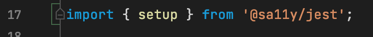
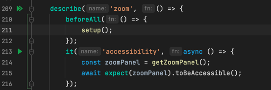

# Accessibility

## Test unit

Salesforce's accessibility framework (ie: [@sa11y/jest NPM package](https://github.com/salesforce/sa11y)) is installed in our repository.

###How to

As a new [Jest matcher](https://github.com/salesforce/sa11y/blob/09bb4b86cfb6dba0a4d083ee98facfc58d948cd3/packages/jest/src/matcher.ts#L40), you do have to register it at the test module level via the [@sa11y/Jest#setup](https://github.com/salesforce/sa11y/blob/09bb4b86cfb6dba0a4d083ee98facfc58d948cd3/packages/jest/src/setup.ts#L39) function call right after having imported it from @sa11y/jest package (see [test module usage documentation](https://github.com/salesforce/sa11y/tree/09bb4b86cfb6dba0a4d083ee98facfc58d948cd3/packages/jest#test-module-level)):

```
import { setup } from '@sa11y/jest'
```

Then you have to invoke the setup function
```
setup();
```

Finally, you do test the JSDOM/HTML part you like via the @sa11y/Jest#toBeAccessible function

A word of caution about this type of check: see https://github.com/salesforce/sa11y/tree/09bb4b86cfb6dba0a4d083ee98facfc58d948cd3/packages/jest#caution

###Example:

Based on @sa11y/jest documentation: https://github.com/salesforce/sa11y/tree/09bb4b86cfb6dba0a4d083ee98facfc58d948cd3/packages/jest#usage

In our repository:
[alcCanvas.test.ts](https://git.soma.salesforce.com/automation-platform/ui-interaction-builder-components/blob/master/packages/%40flow-builder/auto-layout-canvas-ui/src/builder_platform_interaction/alcCanvas/__tests__/alcCanvas.test.ts)

Pay attention to the different required parts (import, setup call and toBeAccessible usage).





For the sake of completeness, @sa11y/jest provides a way to automate the accessibility check after each test in you test module.
The [@sa11y/jest#setup](https://github.com/salesforce/sa11y/tree/master/packages/jest#automatic-checks) function provides indeed some extra options.

All you have to do is:

```
import {setup} from '@sa11y/jest'
setup({ autoCheckOpts: { runAfterEach: true } });
```

see https://github.com/salesforce/sa11y/blob/master/packages/jest/README.md#automatic-checks
