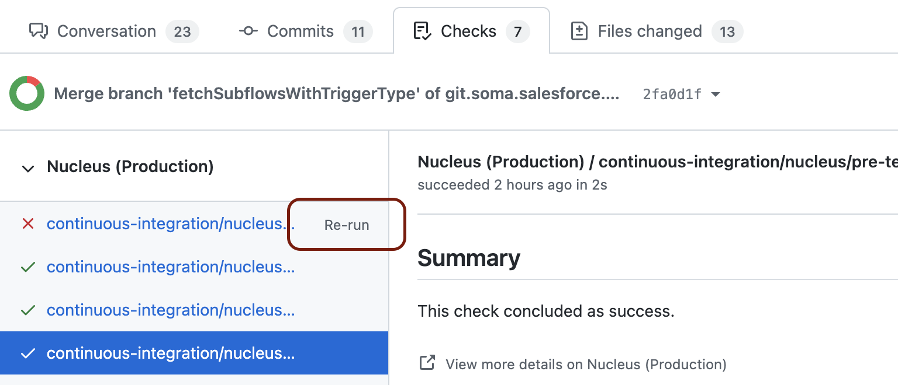

# FAQ

## I have ComponentIntegrationTestSuite test failure. What is it? and What do I do to fix it?

We ship our UI code as a Jar to core. While shipping this jar to core, we pre-compile Aura/LWC components. When new versions of Aura/LWC frameworks are added, to avoid performance issues, it is expected that we re-pre-compile our components. This happen automatically for master/main branch, because of frequency of PRs going into master. But does not for patch branches, for the same reason, frequency. So we need to manually update the pom version to match the latest. Following steps will update the Aura/LWC version accordingly.

1. Checkout core-*-patch branch.
2. Create a new feature branch and add a dummy commit.
    1. git commit -m "update aura/lwc" --allow-empty
3. Create PR and merge into core-*-patch branch.

Example (https://gus.lightning.force.com/lightning/r/ADM_Work__c/a07EE000015l1shYAA/view) for reference.

## My core-deploy failed, how do I re-trigger the deploy phase?

1. After the issue is fixed, navigate to PR.
2. Open checks tab.
3. Find the failing check. Hit 're-run'

