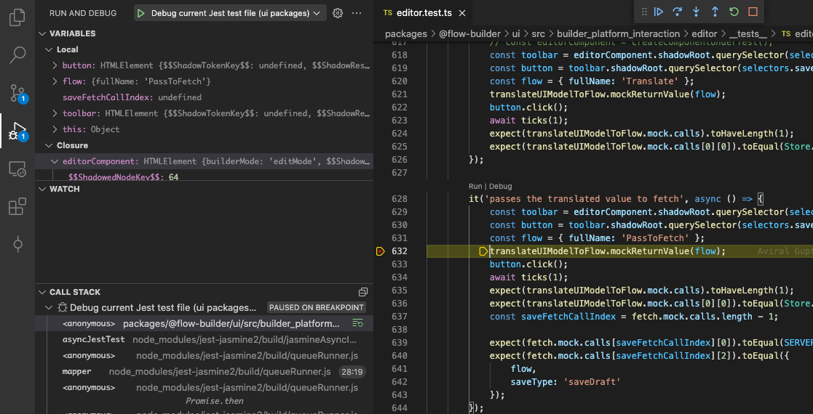
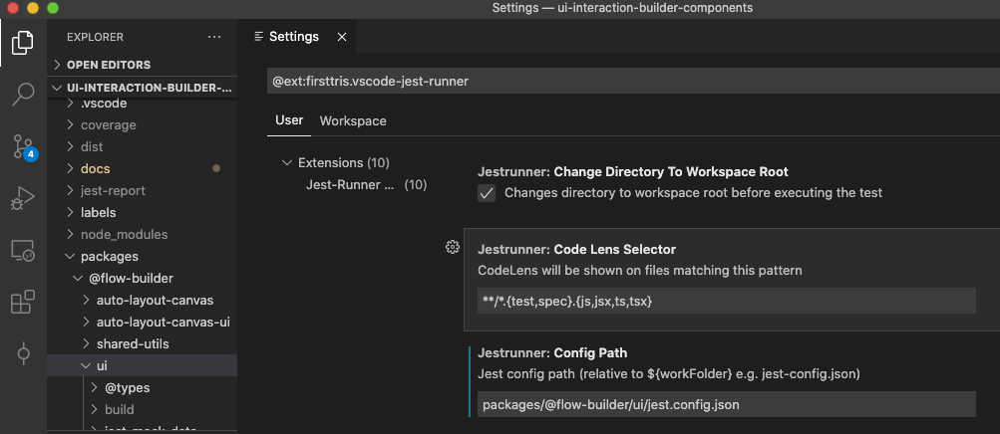
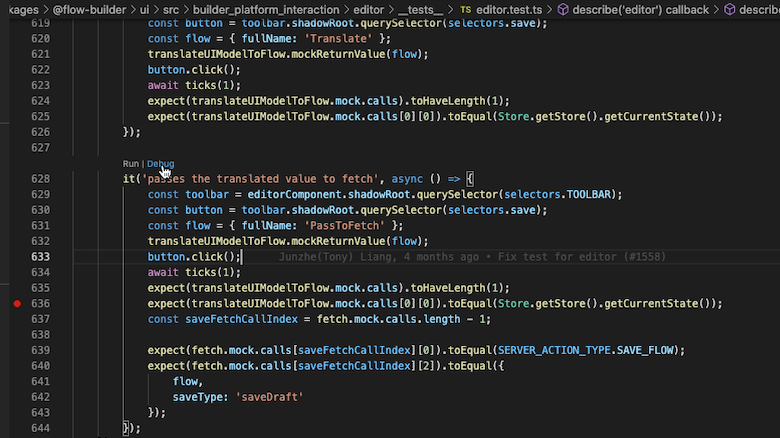
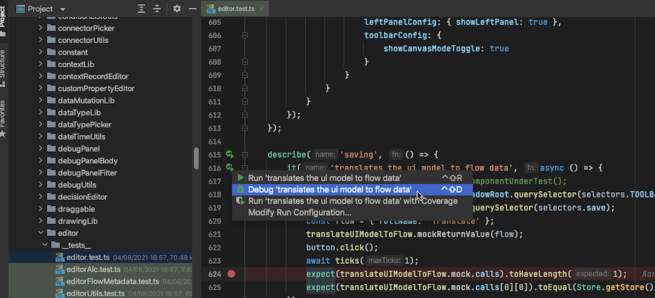

# Run/Debug Jest test(s) inside your IDE

##VSCode

For UI packages (ie: [@flow-builder/ui](/packages/@flow-builder/ui) and [@flow-builder/auto-layout-canvas-ui](/packages/@flow-builder/auto-layout-canvas-ui)) a [VSCode](https://code.visualstudio.com/) [debug configuration file](/.vscode/launch.json) has been added to the repository.
You can directly use this to debug inside VSCode adding some breakpoints directly in your IDE and benefit from [VSCode debug features](https://code.visualstudio.com/docs/editor/debugging).
To debug your test file, open it, add your breakpoint, open the debug view from the activity bar and simply run the configuration in place ("Debug current Jest test file (ui packages)" by default).

Example:

A couple of [VSCode Jest extensions](https://marketplace.visualstudio.com/search?term=jest&target=VSCode&category=All%20categories&sortBy=Relevance) can make your life even easier, providing ways to debug a single test for instance (see [Jest Runner](https://marketplace.visualstudio.com/items?itemName=firsttris.vscode-jest-runner) among others).

###Jest runner extension configuration

The Jest runner extension needs to be configured: you do have to properly set the path to the Jest config file (ie: jest.config.json) of the UI package the test belongs to.

Example (for @flow-builder/ui package)

for @flow-builder/auto-layout-canvas-ui package, change accordingly:
`packages/@flow-builder/auto-layout-canvas-ui/jest.config.json`

Then you should be good to go adding your breaking, and just clicking and the debug link to run a single Jest test.

##WebStorm

WebStorm is a lightweight and powerful JavaScript IDE developed by JetBrains. It can easily handle complex client-side and server-side development with Node.js (https://nodejs.org/en/)

More details: _https://www.jetbrains.com/webstorm/_ (https://www.jetbrains.com/webstorm/)

### How to install WebStorm

Source: _https://confluence.internal.salesforce.com/pages/viewpage.action?spaceKey=ITSAM&title=JetBrains+Software_ (https://confluence.internal.salesforce.com/display/SIUSC/JetBrains+WebStorm)

### Running test(s)

You can run and debug tests with Jest right in WebStorm. You can see the test results in a treeview and easily navigate to the test source from there. Test status is shown next to the test in the editor with an option to quickly run it or debug it.
You can run a single test OOTB against any package (ie: not only UI ones) without any extra plugin required and its package specific configuration (as for Jest runner in VSCode for instance).

see https://www.jetbrains.com/help/webstorm/running-unit-tests-on-jest.html#ws_jest_running_tests for details.

